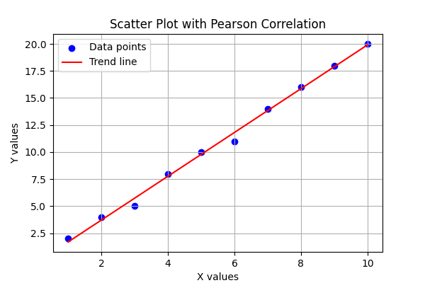

# aimlmid2026_n_chorgoliani25
AI and ML for Cybersecurity – Midterm Exam
## Task 1 – Finding Pearson Correlation

### Data Collection
The data points were collected manually by hovering over the points on the provided online graph. The coordinates were recorded and stored in a CSV file.

### Methodology
Pearson's correlation coefficient was calculated using the scipy.stats.pearsonr function. This method measures the linear relationship between two continuous variables.

### Results
The calculated Pearson correlation coefficient is:
- **r = 0.9977**
- **p-value ≈ 1.19 × 10⁻¹⁰**

This indicates a very strong positive linear correlation between the variables.

### Visualization
The scatter plot below shows the relationship between X and Y values, along with a fitted linear trend line.

## Task 2 – Spam Email Classification using Logistic Regression

### Dataset
The dataset consists of 2500 email records with the following features:
- words
- links
- capital_words
- spam_word_count  
The target variable is `is_spam`.

### Methodology
A Logistic Regression classifier was used to distinguish between spam and non-spam emails.
The dataset was split into training (80%) and testing (20%) sets.
Model training was performed using scikit-learn with a maximum of 1000 iterations.

### Results
- **Accuracy:** 94.6%

**Confusion Matrix:**
- True Negatives: 229
- False Positives: 4
- False Negatives: 23
- True Positives: 244

**Classification Performance:**
- Precision (Spam): 0.98
- Recall (Spam): 0.91
- F1-score (Spam): 0.95

These results indicate that the model performs very well in detecting spam emails with high precision and recall.

### Conclusion
Logistic Regression proved to be an effective and interpretable machine learning model for spam email classification. Such models can be used as a foundational component in cybersecurity email filtering systems.
